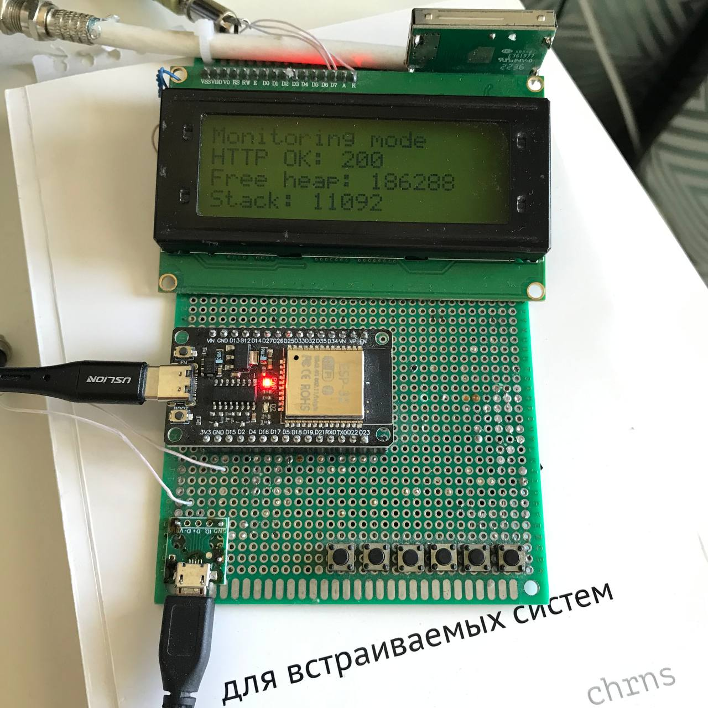
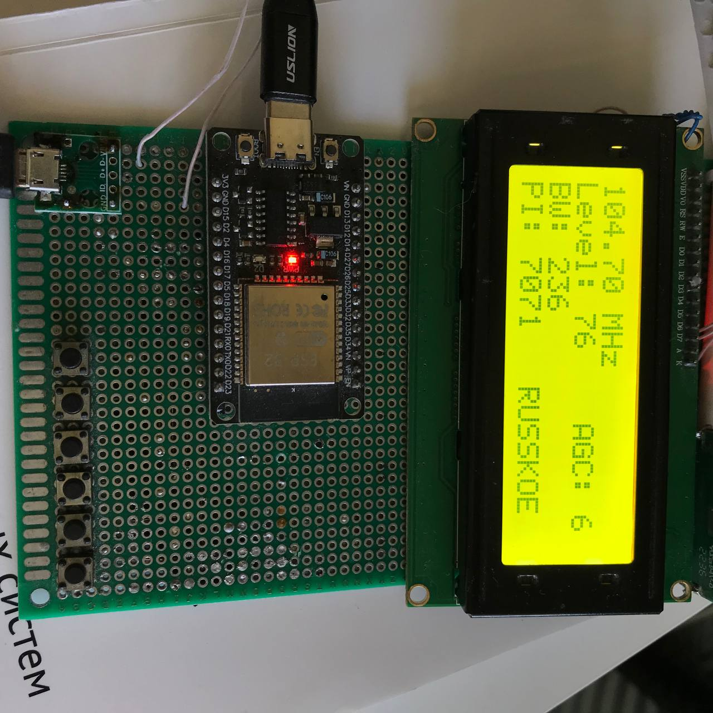
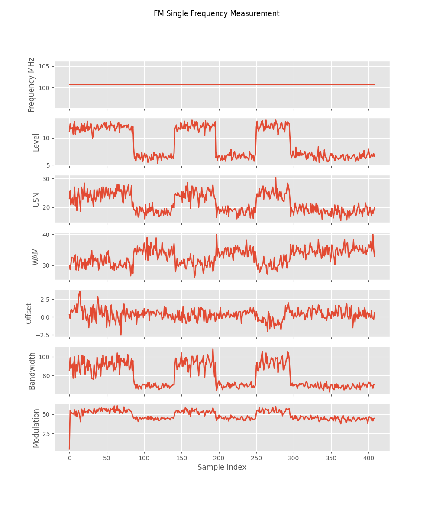

# TEF6686_autodx

## Описание
TEF6686_autodx — мой проект на базе ESP32 и DSP-тюнера NXP TEF6686, предназначенный для автоматического сканирования диапазона и отслеживания дальних FM-радиостанций.

Проект создан на основе [моего исследования](https://amironoff.ru/?go=all/issledovanie-vozmozhnostey-tef6686-chast-1/) возможностей чипа TEF6686.

## Возможности
- Автоматическое сканирование диапазона
- Передача зарегистрированных данных по REST API на сервер в БД MySQL
- Анализ полученных данных на сервере (PHP)
- Детектирование наличия дальних станций
- Уведомления о дальних станциях через бота в Телеграм
- Вывод графиков в Grafana по каждой частоте (Level, Bandwidth и другие показатели)
- Декодер RDS
- Сервисный режим (телеметрия отправляется в UART для отладки)
- Ручной режим прослушивания

## Железо
- ESP32
- Модуль/чип TEF6686
- Дисплей 2004

## Софт
- Язык C (FreeRTOS, i2c)
- REST API, JSON
- PHP, MySQL
- Grafana
- Python (вывод данных из UART)

## Использование приёмника
### Monitoring mode
Запускается автоматически при подаче питания. Сканирует диапазон и отправляет телеметрию на сервер.

### Radio mode
Ручной режим настройки и приёма. Отображаются показатели Level, AGC, BW и RDS.

### Service mode
Сервисный режим. Зарегистрированная телеметрия отправляется в UART для ручного анализа.

### Settings mode
Настройки приёмка. Планирую добавить изменение настроек AGC и некоторых других параметров приёмника.

## Фото и видео
[Видео](https://rutube.ru/video/private/54121d4a54da772ec80f4cac57af5886/?p=fjRjQla9kpcqGUS7Zq8AfQ) с приёмом дальней станции из Швеции (расстояние около 2000 км)

Monitoring mode

Radio mode

Service mode, графики, Python

## Todo
Развести плату в KiCad, перенести приёмник на неё. Убрать в корпус.